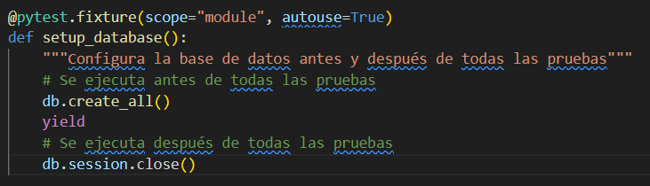
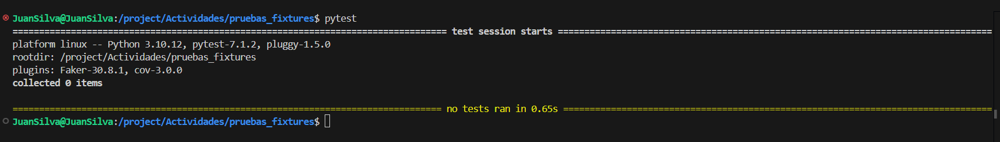
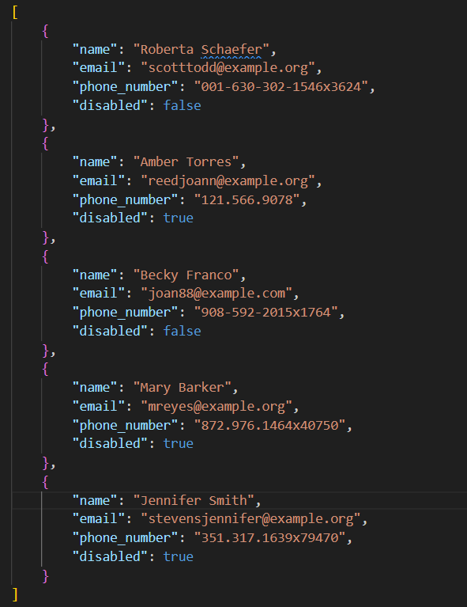
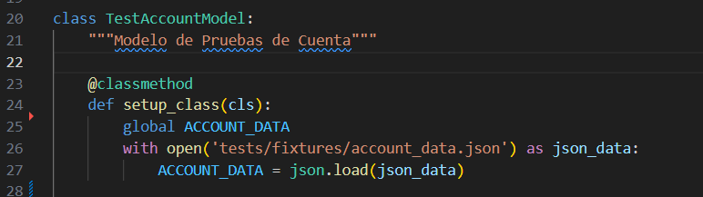
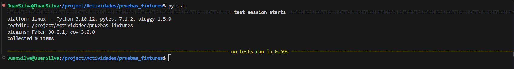
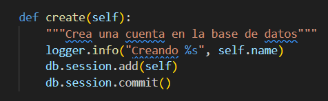
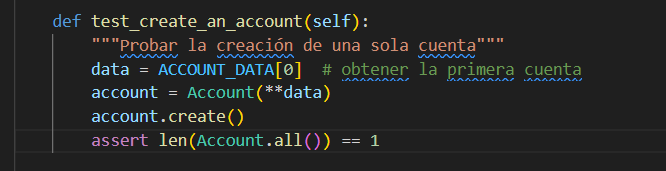
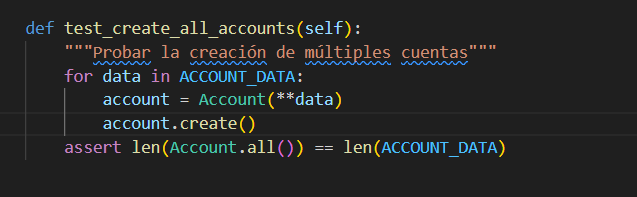
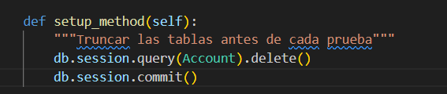
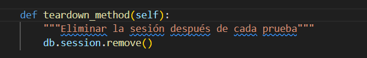

# Actividad: Revisión de fixtures en pruebas  

```python
import pytest

class TestExample:
    @classmethod
    def setup_class(cls):
        # Se ejecuta una vez antes de todas las pruebas en la clase
        print("Configurando la clase de pruebas")

    @classmethod
    def teardown_class(cls):
        # Se ejecuta una vez después de todas las pruebas en la clase
        print("Desmontando la clase de pruebas")

    def setup_method(self, method):
        # Se ejecuta antes de cada prueba
        print("Preparando el entorno de prueba")

    def teardown_method(self, method):
        # Se ejecuta después de cada prueba
        print("Limpiando el entorno de prueba")
```  

  
## Paso 1: Inicializar la base de datos  
`db.create_all()`: se ejecuta antes de todas las pruebas y crea todas las tablas de la base de datos que se necesiten.

`yield`: Actúa como una pausa, lo que sigue después del yiel se ejecuta despues de todas las pruebas.  

`db.session.close()`: ierra la conexión con la base de datos y limpia cualquier sesión abierta.  

  
  
Las pruebas de ejecutan correctamente:  
  
  
  
## Paso 2: Cargar datos de prueba  
  
Se crea un Json para los datos de prueba:  
  
  
  
El método `setup_class( )` se ejecuta una vez antes de todas las prueba, en este caso se carga el json en un variable global `ACCOUNT_DATA`  

  
    
El método `teardown_class( )` se ejecuta después de todas las pruebas  


  
Vemos que no hay ningún error, las pruebas se ejecutan normlamente  

  
  
## Paso 3: Escribir un caso de prueba para crear una cuenta  
El método que se va a testear es el método `create( )`  

  
    
Creamos 1 cuenta  

 
  
## Paso 4: Escribir un caso de prueba para crear todas las cuentas  
Creamos las cinco cuentas que tenemos en el json  

  
  
## Paso 5: Limpiar las tablas antes y después de cada prueba  
Esto es equivalente a un `beforeEach()`, entonces antes de cada prueba limpieamos la base de datos.  

   
  

El método `teardonw_method` es equivalente a un afterEach, en este caso cerramos la sesión   

